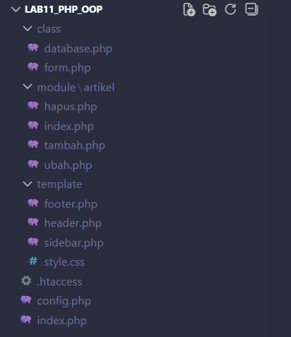
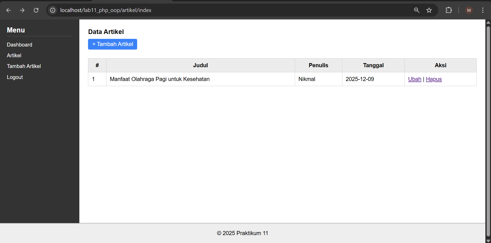
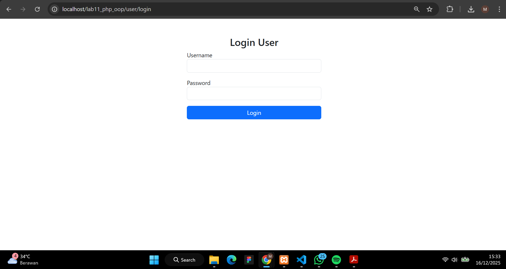
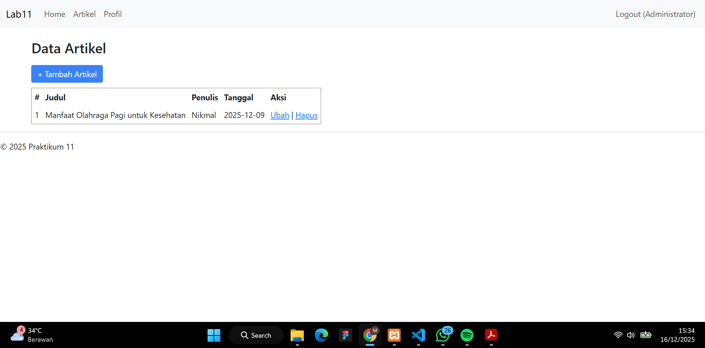
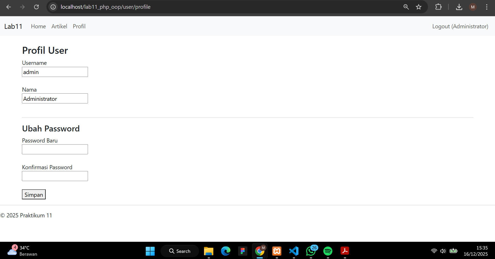
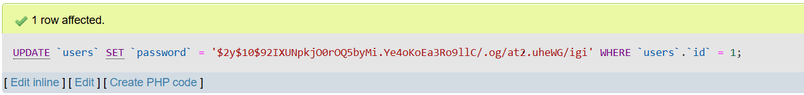

- Nama: Muhamad Nikmal Wahid
- Kelas: TI 24 A3

# PRATIKUM 11 - PHP OOP LANJUTAN 

## Struktur Folder 



## Form.php 

```
<?php
/**
 * Nama Class: Form
 * Deskripsi: Class untuk membuat form inputan dinamis (Text, Textarea, Select, Radio, Checkbox)
 */
class Form
{
    private $fields = array();
    private $action;
    private $submit = "Submit Form";
    private $jumField = 0;

    public function __construct($action = "", $submit = "Submit Form")
    {
        $this->action = $action;
        $this->submit = $submit;
    }

    public function displayForm()
    {
        echo "<form action='" . $this->action . "' method='POST'>";
        echo '<table width="100%" border="0">';

        foreach ($this->fields as $field) {
            echo "<tr><td align='right' valign='top' style='width:180px;'>" . $field['label'] . "</td>";
            echo "<td>";

            switch ($field['type']) {

                case 'textarea':
                    echo "<textarea name='" . $field['name'] . "' cols='30' rows='4'></textarea>";
                    break;

                case 'select':
                    echo "<select name='" . $field['name'] . "'>";
                    foreach ($field['options'] as $value => $label) {
                        echo "<option value='" . $value . "'>" . $label . "</option>";
                    }
                    echo "</select>";
                    break;

                case 'radio':
                    foreach ($field['options'] as $value => $label) {
                        echo "<label style='margin-right:10px;'><input type='radio' name='" . $field['name'] . "' value='" . $value . "'> " . $label . "</label> ";
                    }
                    break;

                case 'checkbox':
                    foreach ($field['options'] as $value => $label) {
                        echo "<label style='margin-right:10px;'><input type='checkbox' name='" . $field['name'] . "[]' value='" . $value . "'> " . $label . "</label> ";
                    }
                    break;

                case 'password':
                    echo "<input type='password' name='" . $field['name'] . "'>";
                    break;

                default:
                    echo "<input type='text' name='" . $field['name'] . "'>";
                    break;
            }

            echo "</td></tr>";
        }

        echo "<tr><td colspan='2'>";
        echo "<input type='submit' value='" . $this->submit . "'></td></tr>";
        echo "</table>";
        echo "</form>";
    }

    /**
     * addField
     * @param string 
     * @param string 
     * @param string 
     * @param array 
     */
    public function addField($name, $label, $type = "text", $options = array())
    {
        $this->fields[$this->jumField]['name'] = $name;
        $this->fields[$this->jumField]['label'] = $label;
        $this->fields[$this->jumField]['type'] = $type;
        $this->fields[$this->jumField]['options'] = $options;
        $this->jumField++;
    }
}
?>

```
Class Form.php berfungsi sebagai helper dalam pembuatan elemen form HTML. Class ini membantu pembuatan input, tombol, dan elemen form lainnya secara dinamis sehingga kode menjadi lebih rapi dan terorganisir. Penggunaan class Form juga menunjukkan penerapan konsep OOP dalam pengembangan aplikasi web berbasis PHP.


## database.php

```
<?php
class Database
{
    protected $host;
    protected $user;
    protected $password;
    protected $db_name;
    protected $conn;

    public function __construct()
    {
        $this->getConfig();
        $this->conn = new mysqli($this->host, $this->user, $this->password, $this->db_name);
        if ($this->conn->connect_error) {
            die("Connection failed: " . $this->conn->connect_error);
        }
    }

    private function getConfig()
    {
        include(__DIR__ . '/../config.php');
        $this->host = $config['host'];
        $this->user = $config['username'];
        $this->password = $config['password'];
        $this->db_name = $config['db_name'];
    }

    public function query($sql)
    {
        return $this->conn->query($sql);
    }

    // mengembalikan satu row (associative) — sesuai PDF get() awalnya fetch_assoc
    public function get($table, $where = null)
    {
        if ($where) {
            $where = " WHERE " . $where;
        }
        $sql = "SELECT * FROM " . $table . $where;
        $res = $this->conn->query($sql);
        if ($res && $res->num_rows > 0) {
            return $res->fetch_assoc();
        }
        return null;
    }

    // helper ambil banyak data
    public function getAll($table, $where = null)
    {
        if ($where) $where = " WHERE " . $where;
        $sql = "SELECT * FROM " . $table . $where;
        $res = $this->conn->query($sql);
        $rows = [];
        if ($res) {
            while ($row = $res->fetch_assoc()) {
                $rows[] = $row;
            }
        }
        return $rows;
    }

    public function insert($table, $data)
    {
        if (is_array($data) && count($data) > 0) {
            $column = [];
            $value = [];
            foreach ($data as $key => $val) {
                $column[] = $key;
                $value[] = "'" . $this->conn->real_escape_string($val) . "'";
            }
            $columns = implode(",", $column);
            $values = implode(",", $value);
            $sql = "INSERT INTO " . $table . " (" . $columns . ") VALUES (" . $values . ")";
            $res = $this->conn->query($sql);
            return $res ? $this->conn->insert_id : false;
        }
        return false;
    }

    public function update($table, $data, $where)
    {
        if (!is_array($data) || empty($where)) return false;
        $update_value = [];
        foreach ($data as $key => $val) {
            $update_value[] = "$key='" . $this->conn->real_escape_string($val) . "'";
        }
        $update_value = implode(",", $update_value);
        $sql = "UPDATE " . $table . " SET " . $update_value . " WHERE " . $where;
        $res = $this->conn->query($sql);
        return $res ? true : false;
    }

    public function delete($table, $where)
    {
        if (empty($where)) return false;
        $sql = "DELETE FROM " . $table . " WHERE " . $where;
        return $this->conn->query($sql);
    }
}
?>
```
Class Database.php dibuat untuk mengelola koneksi dan operasi database menggunakan konsep Object Oriented Programming (OOP). Class ini bertanggung jawab untuk membuka koneksi ke database MySQL serta menyediakan method untuk menjalankan perintah SQL. Dengan memanfaatkan class ini, kode yang berkaitan dengan database menjadi lebih terstruktur, mudah digunakan kembali, dan tidak perlu menuliskan kode koneksi berulang kali di setiap halaman.


## Konfigurasi Dasar (config.php)

```
<?php

$config = [
    'host' => 'localhost',
    'username' => 'root',
    'password' => '',
    'db_name' => 'latihan_oop' 
];
?>
```

File config.php berfungsi sebagai tempat penyimpanan konfigurasi utama aplikasi. Di dalam file ini terdapat pengaturan koneksi database seperti nama host, username, password, dan nama database. Selain itu, file ini juga mendefinisikan konstanta BASE_URL yang digunakan sebagai acuan utama dalam pembuatan link dan pemanggilan asset seperti file CSS. Dengan adanya BASE_URL, seluruh link dalam aplikasi dapat berjalan dengan konsisten meskipun berada pada halaman yang berbeda.

# Tugas Dan Implementasi 



## .htaccess 
```
<IfModule mod_rewrite.c>
    RewriteEngine On
    RewriteBase /lab11_php_oop/

    RewriteCond %{REQUEST_FILENAME} !-d
    RewriteCond %{REQUEST_FILENAME} !-f

    RewriteRule ^(.*)$ index.php?path=$1 [L,QSA]
</IfModule>
```

File .htaccess digunakan untuk mengaktifkan fitur URL rewriting pada web server Apache. Dengan adanya file ini, semua permintaan URL diarahkan ke file index.php tanpa perlu menuliskan nama file PHP secara langsung. Hal ini membuat URL menjadi lebih rapi, mudah dibaca, dan mendukung penerapan sistem routing dalam aplikasi. Penggunaan .htaccess juga membantu menyembunyikan struktur file asli dari pengguna.


## module/artikel/index.php
```
<?php

$db = new Database();

$rows = $db->getAll('artikel');

echo "<h3>Data Artikel</h3>";

echo "<a href='/lab11_php_oop/artikel/tambah' 
        style='display:inline-block;margin:10px 0;padding:6px 12px;background:#3b82f6;color:#fff;text-decoration:none;border-radius:4px;'> 
        + Tambah Artikel
      </a>";

if (!$rows) {
    echo "<p>Belum ada data artikel.</p>";
} else {
    echo "<table border='1' cellpadding='6' cellspacing='0'>";
    echo "<tr><th>#</th><th>Judul</th><th>Penulis</th><th>Tanggal</th><th>Aksi</th></tr>";
    $i = 1;
    foreach ($rows as $r) {
        echo "<tr>";
        echo "<td>{$i}</td>";
        echo "<td>" . htmlspecialchars($r['judul'] ?? '') . "</td>";
        echo "<td>" . htmlspecialchars($r['penulis'] ?? '') . "</td>";
        echo "<td>" . htmlspecialchars($r['tanggal'] ?? '') . "</td>";
        echo "<td>
                <a href='/lab11_php_oop/artikel/ubah?id=" . urlencode($r['id'] ?? '') . "'>Ubah</a> |
                <a href='/lab11_php_oop/artikel/hapus?id=" . urlencode($r['id'] ?? '') . "' onclick=\"return confirm('Hapus?')\">Hapus</a>
              </td>";
        echo "</tr>";
        $i++;
    }
    echo "</table>";
}
?>
```

File ini menampilkan daftar seluruh artikel dari database menggunakan class Database. Halaman ini juga menyediakan tombol untuk mengedit dan menghapus data. Modul ini adalah implementasi fitur Read dalam CRUD.


## module/artikel/tambah.php

```
<?php
$db = new Database();
$form = new Form("", "Simpan Data");

if ($_POST) {
    $data = [
        'judul' => $_POST['judul'] ?? '',
        'penulis' => $_POST['penulis'] ?? '',
        'tanggal' => $_POST['tanggal'] ?? date('Y-m-d'),
        'isi' => $_POST['isi'] ?? ''
    ];

    $insertId = $db->insert('artikel', $data);
    if ($insertId) {
        echo "<div style='color:green'>Data berhasil disimpan. ID: {$insertId}</div>";
    } else {
        echo "<div style='color:red'>Gagal menyimpan data.</div>";
    }
}

?>
<h3>Tambah Artikel</h3>
<form method="post">
    <label>Judul</label><br>
    <input type="text" name="judul"><br><br>

    <label>Penulis</label><br>
    <input type="text" name="penulis"><br><br>

    <label>Tanggal</label><br>
    <input type="date" name="tanggal" value="<?= date('Y-m-d') ?>"><br><br>

    <label>Isi</label><br>
    <textarea name="isi" cols="50" rows="6"></textarea><br><br>

    <input type="submit" value="Simpan">
</form>

```

Halaman ini menampilkan form tambah artikel menggunakan class Form. Setelah form disubmit, data akan disimpan ke tabel artikel melalui fungsi insert pada Database. Modul ini merupakan implementasi operasi Create.

## module/artikel/hapus.php
```
<?php

if (!isset($_SESSION['login'])) {
    echo "<script>alert('Harus login dulu'); window.location='/lab11_php_oop/auth/login';</script>";
    exit;
}

if (!isset($_GET['id']) || $_GET['id'] == '') {
    echo "<script>alert('ID artikel tidak ditemukan!'); window.location='/lab11_php_oop/artikel/index';</script>";
    exit;
}

$id = intval($_GET['id']); 

$db = new Database();
$hapus = $db->delete("artikel", "id=$id");

if ($hapus) {
    echo "<script>alert('Artikel berhasil dihapus!'); window.location='/lab11_php_oop/artikel/index';</script>";
} else {
    echo "<script>alert('Gagal menghapus artikel.'); window.location='/lab11_php_oop/artikel/index';</script>";
}
?>

```
File ini berfungsi untuk menghapus artikel berdasarkan ID. Setelah proses delete selesai, sistem akan mengarahkan kembali ke halaman daftar artikel. Inilah bagian Delete dalam CRUD.


## modules/artikel/ubah.php
```
<?php
$db = new Database();

$id = isset($_GET['id']) ? intval($_GET['id']) : 0;
if ($id <= 0) {
    echo "<p>Parameter ID tidak valid.</p>";
    return;
}

$existing = $db->get('artikel', "id={$id}");
if (!$existing) {
    echo "<p>Data tidak ditemukan.</p>";
    return;
}

if ($_POST) {
    $data = [
        'judul' => $_POST['judul'] ?? '',
        'penulis' => $_POST['penulis'] ?? '',
        'tanggal' => $_POST['tanggal'] ?? date('Y-m-d'),
        'isi' => $_POST['isi'] ?? ''
    ];
    $ok = $db->update('artikel', $data, "id={$id}");
    if ($ok) {
        echo "<div style='color:green'>Data berhasil diupdate.</div>";
        // ambil ulang data
        $existing = $db->get('artikel', "id={$id}");
    } else {
        echo "<div style='color:red'>Gagal update data.</div>";
    }
}

?>
<h3>Ubah Artikel</h3>
<form method="post">
    <label>Judul</label><br>
    <input type="text" name="judul" value="<?= htmlspecialchars($existing['judul'] ?? '') ?>"><br><br>

    <label>Penulis</label><br>
    <input type="text" name="penulis" value="<?= htmlspecialchars($existing['penulis'] ?? '') ?>"><br><br>

    <label>Tanggal</label><br>
    <input type="date" name="tanggal" value="<?= htmlspecialchars($existing['tanggal'] ?? date('Y-m-d')) ?>"><br><br>

    <label>Isi</label><br>
    <textarea name="isi" cols="50" rows="6"><?= htmlspecialchars($existing['isi'] ?? '') ?></textarea><br><br>

    <input type="submit" value="Update">
</form>

```
Halaman untuk mengedit artikel yang sudah ada. Data lama ditampilkan terlebih dahulu pada input form, kemudian disimpan kembali ke database melalui method update. Modul ini merupakan bagian dari Update dalam CRUD.


## header.php
```
<?php
if (session_status() === PHP_SESSION_NONE) {
    session_start();
}
?>
<!DOCTYPE html>
<html>
<head>
    <meta charset="UTF-8">
    <title>Praktikum 11 - PHP OOP LANJUTAN</title>

    <link rel="stylesheet" href="/lab11_php_oop/template/style.css">
</head>

<body>

<div class="layout">
    
    <?php include __DIR__ . "/sidebar.php"; ?>

    <main class="content">

```

## footer.php 
```
    </main>
</div>

<hr>
<footer>
    <p>&copy; <?= date('Y'); ?> Praktikum 11</p>
</footer>

</body>
</html>
```

## sidebar.php 
```
<aside class="sidebar">
    <h3>Menu</h3>
    <ul>
        <li><a href="/lab11_php_oop/home/index">Dashboard</a></li>
        <li><a href="/lab11_php_oop/artikel/index">Artikel</a></li>
        <li><a href="/lab11_php_oop/artikel/tambah">Tambah Artikel</a></li>
        <li><a href="/lab11_php_oop/auth/logout">Logout</a></li>
    </ul>
</aside>
```


# Autentikasi dan Session

## module/user/login.php 
```
<?php
if (isset($_SESSION['is_login'])) {
    header('Location: ../home/index');
    exit;
}

$message = "";

if ($_POST) {
    $db = new Database();

    $username = $_POST['username'];
    $password = $_POST['password'];

    $sql = "SELECT * FROM users WHERE username='$username' LIMIT 1";
    $result = $db->query($sql);
    $data = $result->fetch_assoc();

    if ($data && password_verify($password, $data['password'])) {
        $_SESSION['is_login'] = true;
        $_SESSION['username'] = $data['username'];
        $_SESSION['nama'] = $data['nama'];

        header('Location: ../artikel/index');
        exit;
    } else {
        $message = "Username atau password salah!";
    }
}
?>

<!DOCTYPE html>
<html>
<head>
    <title>Login</title>
    <link href="https://cdn.jsdelivr.net/npm/bootstrap@5.3.0/dist/css/bootstrap.min.css" rel="stylesheet">
</head>
<body>
<div class="container mt-5" style="max-width:400px">
    <h3 class="text-center">Login User</h3>

    <?php if ($message): ?>
        <div class="alert alert-danger"><?= $message ?></div>
    <?php endif; ?>

    <form method="post">
        <div class="mb-3">
            <label>Username</label>
            <input name="username" class="form-control" required>
        </div>
        <div class="mb-3">
            <label>Password</label>
            <input type="password" name="password" class="form-control" required>
        </div>
        <button class="btn btn-primary w-100">Login</button>
    </form>
</div>
</body>
</html>
```

File module/user/login.php digunakan untuk menampilkan form login serta memproses autentikasi pengguna. Pada file ini, data username dan password yang diinput oleh pengguna akan dicek ke database. Jika proses login berhasil, data pengguna akan disimpan ke dalam session sehingga pengguna dapat mengakses halaman lain yang bersifat private.




## module/user/logout.php 

```
<?php
session_destroy();
header("Location: ../user/login");
exit;
```

File module/user/logout.php berfungsi untuk mengakhiri sesi login pengguna. Pada saat logout, session akan dihapus sehingga pengguna tidak lagi memiliki akses ke halaman yang memerlukan autentikasi. Setelah itu, pengguna akan diarahkan kembali ke halaman login.



## Tugas Pertemuan 14 

1. Tambahkan fitur "Profil". Buat halaman di module/user/profile.php yang menampilkan data user yang sedang login (Nama, Username) dan form untuk mengubah Password.
2. Implementasikan logika enkripsi password (password_hash) saat mengubah password di fitur profil tersebut.

Jawaban: 

File module/user/profile.php berfungsi melihat username dan nama serta yerdapat fitur mengubah password. Proses perubahan password dilakukan dengan cara mengenkripsi password baru menggunakan fungsi password_hash() sebelum disimpan ke database. Hal ini bertujuan untuk meningkatkan keamanan data pengguna. 




```
<?php
// Proteksi halaman: wajib login
if (!isset($_SESSION['is_login'])) {
    header("Location: ../user/login");
    exit;
}

$db = new Database();
$message = "";

// Ambil data user dari session
$username = $_SESSION['username'];
$nama     = $_SESSION['nama'];

// Proses ubah password
if ($_POST) {
    $password_baru = $_POST['password_baru'];
    $konfirmasi    = $_POST['konfirmasi_password'];

    if ($password_baru !== $konfirmasi) {
        $message = "Password dan konfirmasi tidak sama!";
    } elseif (strlen($password_baru) < 6) {
        $message = "Password minimal 6 karakter!";
    } else {
        // Enkripsi password
        $hash = password_hash($password_baru, PASSWORD_DEFAULT);

        // Update ke database
        $sql = "UPDATE users SET password='$hash' WHERE username='$username'";
        $db->query($sql);

        $message = "Password berhasil diubah!";
    }
}
?>

<h3>Profil User</h3>

<?php if ($message): ?>
    <p style="color:green"><?= $message ?></p>
<?php endif; ?>

<form method="post">
    <div>
        <label>Username</label><br>
        <input type="text" value="<?= $username ?>" readonly>
    </div>
    <br>

    <div>
        <label>Nama</label><br>
        <input type="text" value="<?= $nama ?>" readonly>
    </div>
    <br>

    <hr>

    <h4>Ubah Password</h4>

    <div>
        <label>Password Baru</label><br>
        <input type="password" name="password_baru" required>
    </div>
    <br>

    <div>
        <label>Konfirmasi Password</label><br>
        <input type="password" name="konfirmasi_password" required>
    </div>
    <br>

    <button type="submit">Simpan</button>
</form>
```

